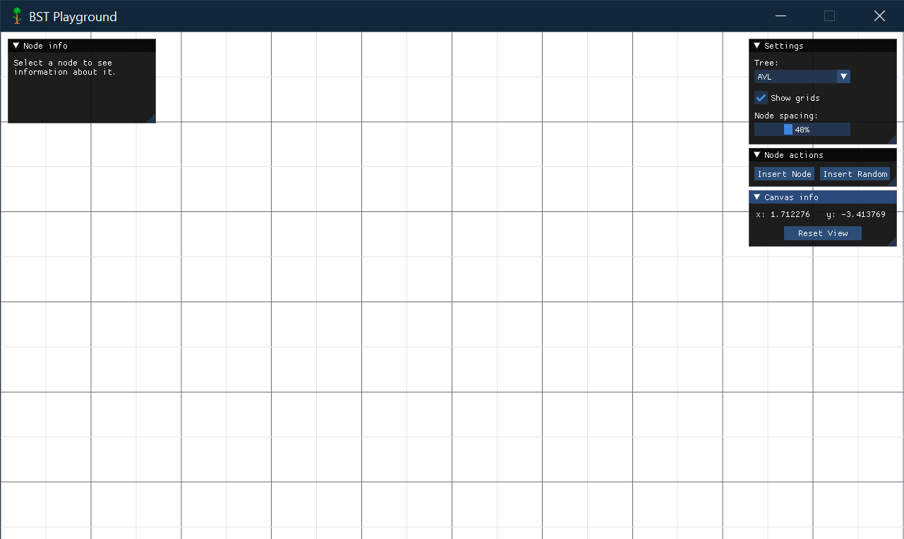
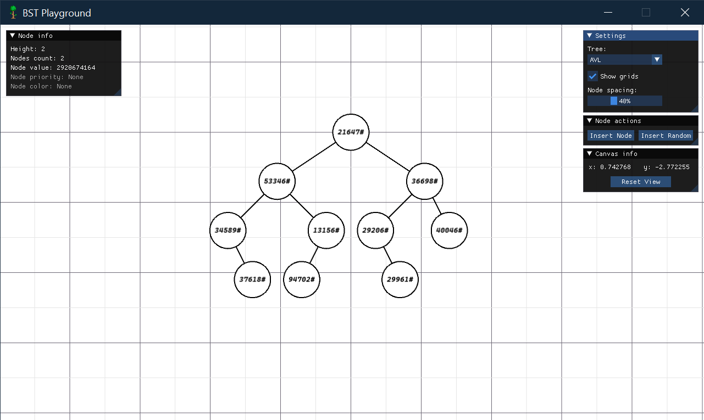
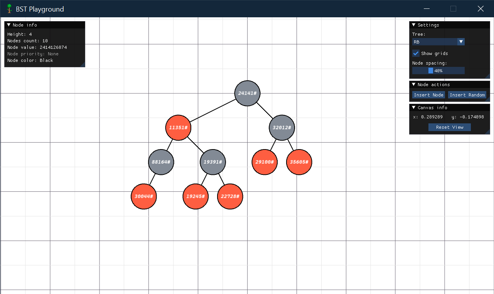
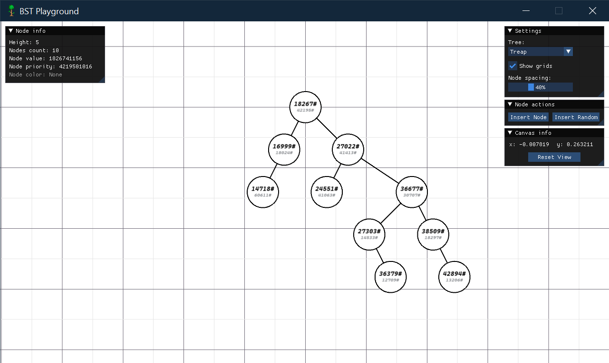

# BST Playground
BST Playground is a light-weight visualization tool for common types of binary search trees, written in C++, using [ImGui-SFML](https://github.com/SFML/imgui-sfml)

## Getting Started
In order to play with application yourself, you should:
1. Clone repository to your PC
2. Look for pre-build binaries in **"builds"** folder
3. **Enjoy!**

> If there is no sufficient build for your system, build application yourself, using CMake.  
**Remember to copy "resources" folder (and optionally "imgui.ini") from any of the supplied builds**

## Features
* **Easily-extensible and optimized(tested on trees of up to 1e5 nodes) tree visualization API,** written using [SFML](https://github.com/SFML/SFML). By default it includes AVL tree, Red-Black tree, Treap and Splay tree
* Friendly and responsible UI made with [Dear ImGui](https://github.com/ocornut/imgui)

## Tree operations
* Insert node with specified value (for Treap you can input priority as well)
* Insert specified amount of randomly-generated nodes
* Delete node by clicking on it

## Authors
* *Mikhail Kaluzhnyy* - **Creator** - [teviroff](https://github.com/teviroff)

## Screenshots
General view:

AVL tree (or generally any BST):

Red-Black tree:

Treap:

